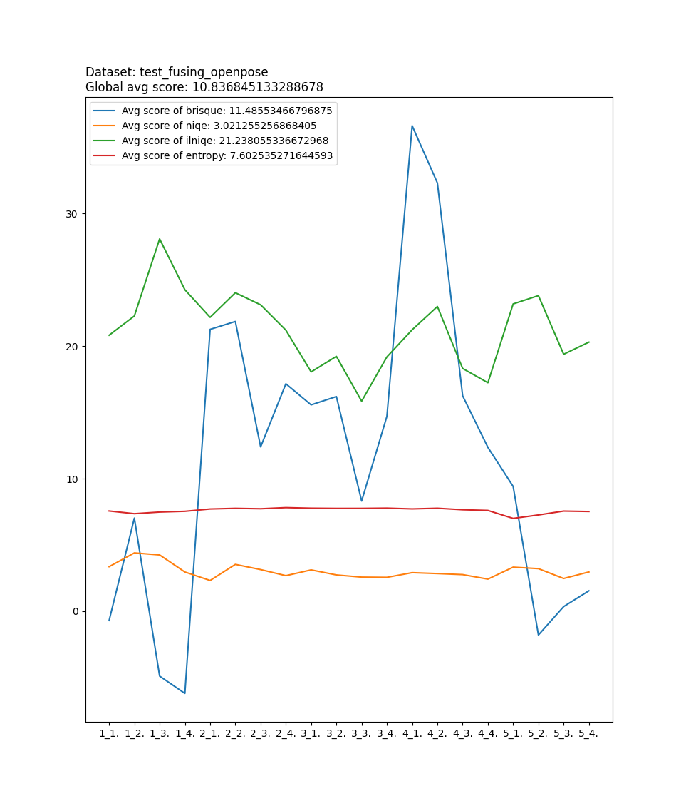
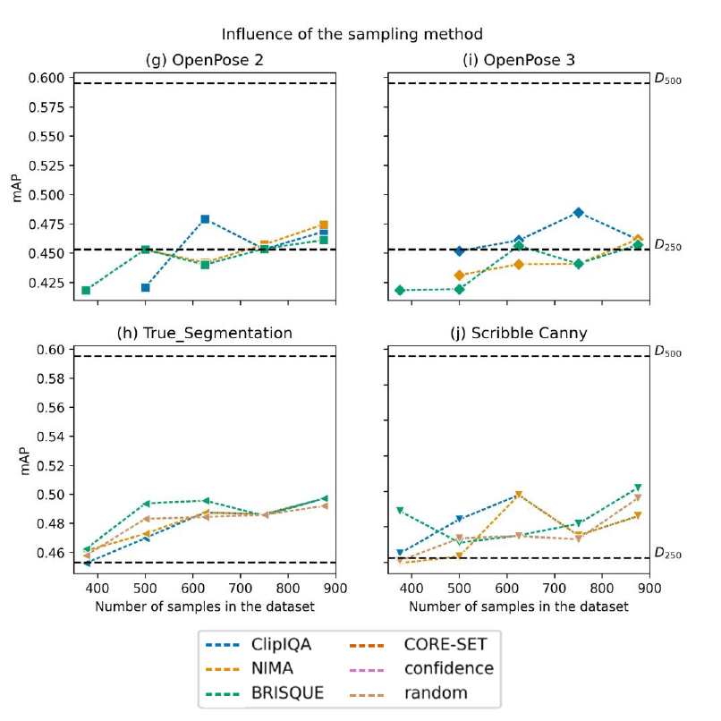
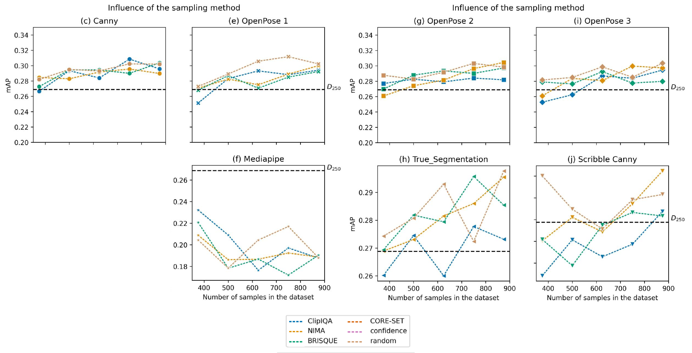
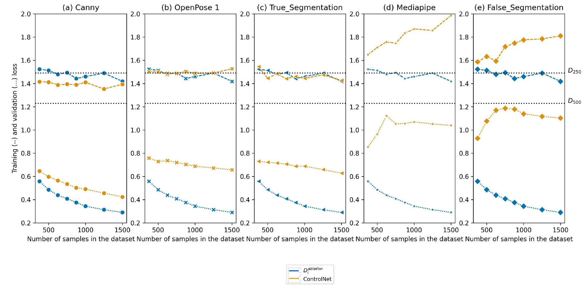
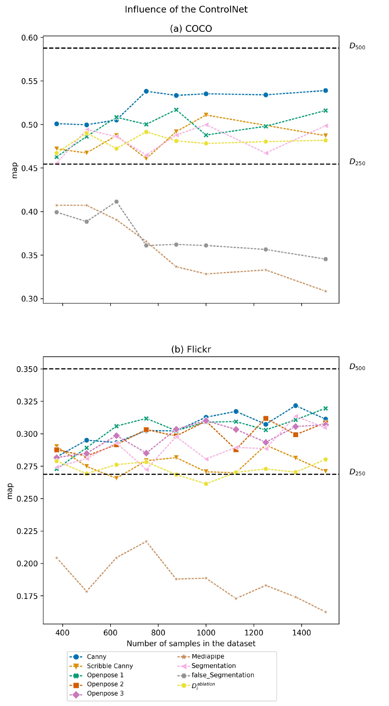

# Data Augmentation with Stable Diffusion for Object Detection using YOLOv8

This is a data generation framework that uses [Stable Diffusion](https://huggingface.co/blog/stable_diffusion)
with [ControlNet](https://huggingface.co/blog/train-your-controlnet).
Models can be trained using a mix of real and generated data. They can also be logged and evaluated.


## Installation

We recommend using a virtual environment. Install requirements :

```
pip install -r requirements.txt
```

## Datasets

- [COCO](https://cocodataset.org/#home) PEOPLE dataset :

```
./run.sh coco
```

- [Flickr30K Entities](https://bryanplummer.com/Flickr30kEntities/) PEOPLE dataset :

```
./run.sh flickr30k
```


Data will be downloaded and put in the respective files for images, labels and captions.

## Generate images

To generate some images, you can use

```bash
./run.sh gen
```

See the `conf/config.yaml` file for all details and configuration options.

You can also configure directly on the command line :

```bash
./run.sh gen model.cn_use=openpose prompt.base="Arnold" prompt.modifier="dancing"
```

If you use the `controlnet_segmentation` ControlNet, You will find your images in `data/generated/controlnet_segmentation` along with the base image and the feature extracted.

The configuration options work for all scripts available in the framework. For example, you can have different initial data sizes by controlling sample numbers : 

```bash
./run.sh coco ml.train_nb=500
```

You can also launch multiple runs. Here's an example of a multi-run with 3 different generators :

```
./run.sh gen model.cn_use=frankjoshua_openpose,fusing_openpose,lllyasviel_openpose
```

List of available models can be found in `conf/config.yaml`. We have 4 available extractors at the moment (Segmentation, OpenPose, Canny, MediaPipeFace), If you add another control-net model, make sure you add one of the following strings to its name to set the extractor to use :

- openpose
- canny
- segmentation
- mediapipe_face


## Test the quality of images with IQA measures

One way of testing the quality of the generated images is to use computational and statistical methods. One good library for it is [IQA-PyTroch](https://github.com/chaofengc/IQA-PyTorch), you can go read its [paper](https://arxiv.org/pdf/2208.14818.pdf).

There are two approaches to measure image quality
- full reference: compare against a real pristine image
- no reference: compute metrics following a learned opinion

You can use metrics in the same way the generation is done:

```bash
# For paper
./run.sh src/iqa_paper.py
# Framework general script
./run.sh iqa
```

It follows the same configuration of the generation part, with the same file `conf/config.yaml`.




There is file created in `data/iqa/<cn_use>_iqa.json` with the following structure:

```
{
    "image_paths": [
        "data/generated/controlnet_segmentation/000000000474_1.png",
        "data/generated/controlnet_segmentation/000000000474_2.png",
        "data/generated/controlnet_segmentation/000000000474_3.png",
        "data/generated/controlnet_segmentation/000000000474_4.png",
        "data/generated/controlnet_segmentation/000000000474_5.png"
    ],
    "name": "controlnet_segmentation",
    "brisque": [
        20.71453857421875,
        11.63690185546875,
        17.65740966796875,
        5.10711669921875,
        32.71502685546875
    ],
    "dbcnn": [
        0.7001792192459106,
        0.6730189323425293,
        0.5987531542778015,
        0.5892908573150635,
        0.5235083699226379
    ],
    "ilniqe": [
        27.35899873000946,
        34.540625520909074,
        26.03838433381286,
        25.595288318528816,
        34.6185153006446
    ]
}
```


## Create YOLO Dataset and Train :

We use wandb to track and visualize trainings.

```
wandb login
```

Create `train.txt`, `val.txt`, et `test.txt` :

```
./run.sh create_dataset
```

Launch the training !

```
./run.sh train
```

You can both create and launch at the same time to be able to execute multiple training with multiple augmentation percents on your server using hydra :

```
./run.sh create_n_train.py -m ml.augmentation_percent=0.1 ml.sampling.enable=True ml.sampling.metric=dbcnn,brisque ml.sampling.sample=best ml.epochs=15
```

## Download and test models 

The download folder can be set in the config file. You'll have folders inside for each wandb project. each project folder contains :

- all models for the project
- summary file with parameters and results (map, precision ..etc)
- in case of running `test.py` : results.csv file containing the test results with map and other info.

```
./run.sh download.py ml.wandb.project=your-project ml.wandb.download.download=true ml.wandb.download.list_all=true

./run.sh test.py 
```

**Note** Other scripts exist to execute different studies, like the usage of Active learning, which is still excremental, you can check the `src` folder for those scripts (This code is still not fully integrated into the framework, some path or configuration modifications might be necessary for correct execution).

## Runs Results Plots

Here are some plots for some of the many runs and studies that we performed :

### Coco Sampling



### Flickr Sampling



### Loss values for COCO



### Random Sampling - Regular Runs



