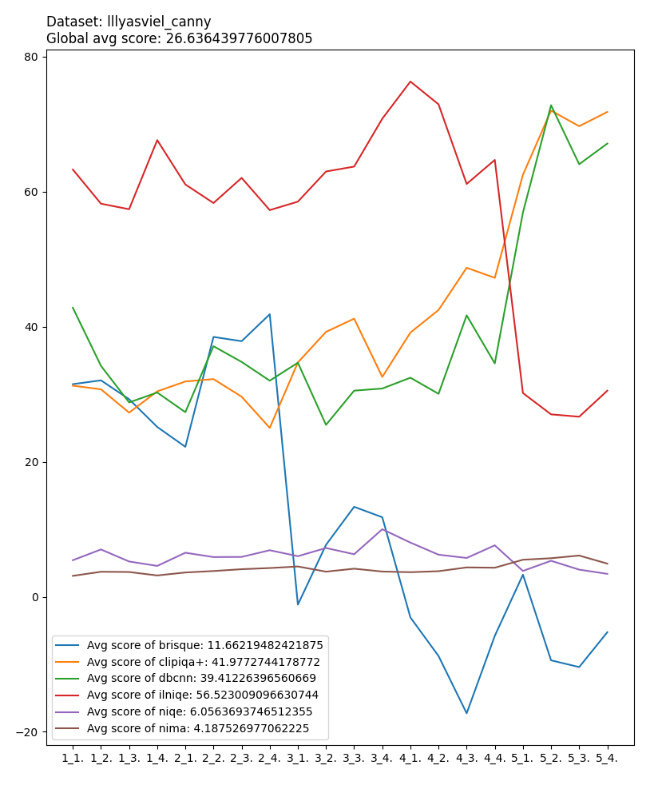

# Data Augmentation with Stable Diffusion for Object Detection using YOLOv8

This is a data generation framework that uses [Stable Diffusion](https://huggingface.co/blog/stable_diffusion)
with [ControlNet](https://huggingface.co/blog/train-your-controlnet).
Models can be trained using a mix of real and generated data. They can also be logged and evaluated.


Make sure to install the requirements :

```
pip install -r requirements.txt
```

We recommend using a virtual environment.

## Datasets

We experimented with PEOPLE from the [COCO](https://cocodataset.org/#home) datasets :

```
./run.sh coco
```

Data will be downloaded and put in the respective files for images, labels and captions.

## Generate test images

To generate some images for the moment you can use

```bash
./run.sh gen
```

See the `conf/config.yaml` file for more details, you can configure your run.

You can also configure directly on the command line :

```bash
./run.sh gen model.cn_use=openpose prompt.base="Trump" prompt.modifier="dancing" data_path.generated=mysupertest
```

You will find your images in `data/mysupertest/openpose` along with the base image and the feature extracted.

<div></div>
<div></div>

<div></div>
<div></div>

<div></div>
<div></div>


## Multi run

You can also launch multiple runs. Here's an example of a multi-run with 3 different generators :

```
./run.sh gen model.cn_use=frankjoshua_openpose,fusing_openpose,lllyasviel_openpose
```

List of available models can be found in `conf/config.yaml`. We have 3 available extractors at the moment (OpenPose, Canny, MediaPipeFace), If you add another control-net model, make sure you add one of the following strings to its name to set the extractor to use :

- openpose
- canny
- mediapipe_face


## Test the quality of images with IQA measures

One way of testing the quality of the generated images is to use computational and statistical methods. One good library for it is [IQA-PyTroch](https://github.com/chaofengc/IQA-PyTorch), you
can go read its [paper](https://arxiv.org/pdf/2208.14818.pdf).


Because images are generated there is no reference image to compare to. We will be using with the
no-reference metrics Note that methods using here are agnostic to the content of the image, no
subjective or conceptual score is given. Measures generated here only give an idea of how
*good looking* the images are.

Methods used:
  - [brisque](https://www.sciencedirect.com/science/article/abs/pii/S0730725X17301340)
  - [cliipiqa](https://arxiv.org/pdf/2207.12396.pdf)
  - [dbccn](https://arxiv.org/pdf/1907.02665v1.pdf)
  - [niqe](https://live.ece.utexas.edu/research/quality/nrqa.html)


You can use these measures in the same way the generation is done:
```bash
./run iqa
```
It follows the same configuration that the generation part, with the same file `conf/config.yaml`.

**Note**: `iqa` is going to search for a directory following the same naming convention that `gen.py`,
that is, the directory has the name `<name chosen by the user>_<cn model used to generate>`.
This are of course in the `config.yaml` file and can be changed statically or dynamically.




### iqa paper 

In this file the approach to measure quality will be the extensive library
IQA-Pytorch: https://github.com/chaofengc/IQA-PyTorch
Read also the paper: https://arxiv.org/pdf/2208.14818.pdf

There are basically two approaches to measure image quality
- full reference: compare againts a real pristine image
- no reference: compute metrics following a learned opinion

Because images are generated there is no reference image to compare to. We
will be using with the no-reference metrics

Note that methods using here are agnostic to the content of the image, no
subjective or conceptual score is given.
Measures generated here only give an idea of how 'good looking' the images
are.

Methods used:
- brisque: https://www.sciencedirect.com/science/article/abs/pii/S0730725X17301340
- dbccn: https://arxiv.org/pdf/1907.02665v1.pdf
- niqe: https://live.ece.utexas.edu/research/quality/nrqa.html


dbcnn is good for: blur, contrast distortion, white and pink noise, dithering, over and under exposure
brisque is good for: distortion, luminance and blur
ilniqe: distortion, blur and compression distortion

Note that metrics have each different ranges: [0, 1], [0, +inf] and also sometimes less is better
and sometimes more is better, it would be a mistake to try to rescale or invert them.
It is better to treat each separately.

There is file created in `data/iqa/<cn_use>_iqa.json` with the following structure:

```
{
    "image_paths": [
        "data/generated/controlnet_segmentation/000000000474_1.png",
        "data/generated/controlnet_segmentation/000000000474_2.png",
        "data/generated/controlnet_segmentation/000000000474_3.png",
        "data/generated/controlnet_segmentation/000000000474_4.png",
        "data/generated/controlnet_segmentation/000000000474_5.png"
    ],
    "name": "controlnet_segmentation",
    "brisque": [
        20.71453857421875,
        11.63690185546875,
        17.65740966796875,
        5.10711669921875,
        32.71502685546875
    ],
    "dbcnn": [
        0.7001792192459106,
        0.6730189323425293,
        0.5987531542778015,
        0.5892908573150635,
        0.5235083699226379
    ],
    "ilniqe": [
        27.35899873000946,
        34.540625520909074,
        26.03838433381286,
        25.595288318528816,
        34.6185153006446
    ]
}
```


## Create YOLO Dataset and Train :

We use wandb to track and visualize trainings.

```
wandb login
```

Create `train.txt`, `val.txt`, et `test.txt` :

```
./run create_dataset
```

Launch the training !

```
./run train
```

### Other 

- NLP is used in the Flickr30K script in order to extract good annotations from captions, run this for it to work :

```
python -m spacy download en_core_web_sm
```